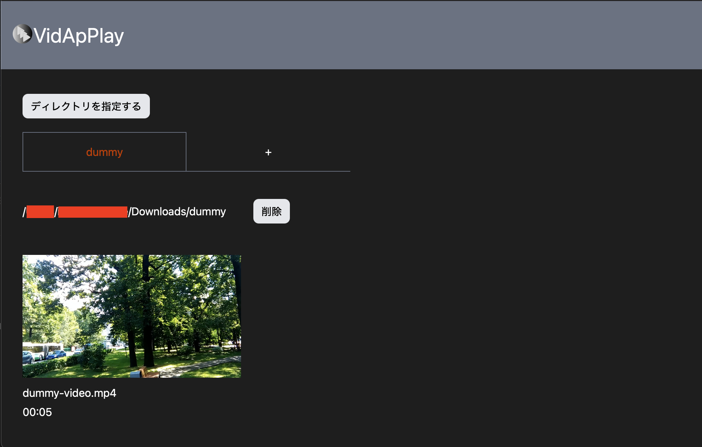

## VidApPlay

## 📡 使用ライブラリ・フレームワーク

| ライブラリ・フレームワーク | バージョン | 使用意図 |
| --- | --- | --- |
| Node.js | v22.10.0 | JavaScript 実行環境 |
| volta | v1.1.1 | Node.js 管理ツール |
| npm | v10.9.0 | Node.js ライブラリ管理ツール |
| Tauri | v2 | デスクトップおよびモバイル・プラットフォームフレームワーク |
| TypeScript | v5.2.2 | 静的型付け用言語 |
| React | v18.3.1 | フロントエンドフレームワーク |
| prettier | v3.5.2 | コードフォーマッター |
| eslint | v3.5.2 | JavaScript linter |
| Headless UI | v2.2.0 | UIコンポーネント |
| tailwindCSS | v4.0.9 | CSSフレームワーク |

## npm scripts について

| script    | 内容                                   |
| --------- | -------------------------------------- |
| `dev`     | 開発環境でのサーバーの起動             |
| `build`   | ビルドの生成                           |
| `preview` | ビルドした成果物でのサーバー起動       |
| `format`  | コードフォーマット                     |
| `lint`    | コードリント                           |
| `bundle`  | デスクトップアプリケーションのバンドル |

## 📚 ライブラリ・フレームワークのインストール

```zsh
# ライブラリのインストール
npm install
```

## 使い方



まずは、再生したい動画を含んだディレクトリを選択してください。  
その後タブの「+」を押下すると、選択したディレクトリに含まれている動画がリストアップされます。

追加したディレクトリは、このアプリケーションを閉じても永続的に保存されます。

表示された動画のサムネイルをクリックすると、ダイアログが表示され動画を再生することができます。
